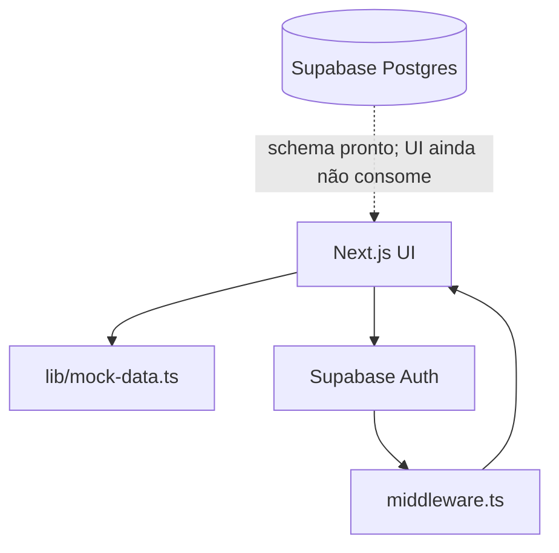
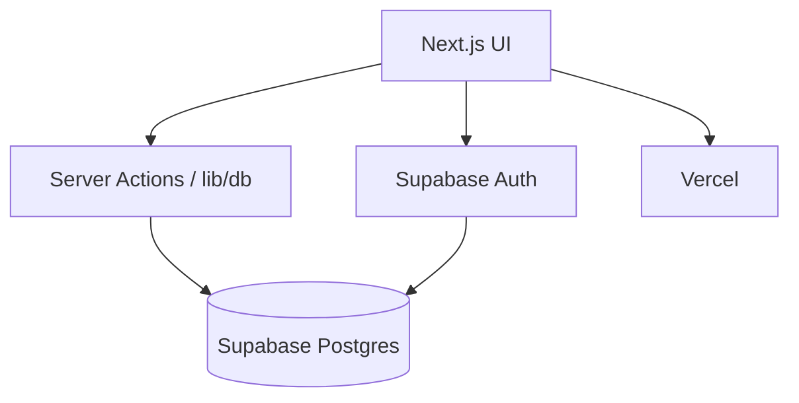

# Guia passo a passo — Arquivo Morto (dev → produção)

Roteiro oficial para evoluir o sistema até **produção** com **Supabase** (Postgres + Auth) e deploy na **Vercel**.

Use as caixas `- [x]` / `- [ ]` para marcar progresso. A ordem importa: não exponha dados sensíveis sem RLS e auth.

---

## Fase atual

| | |
|---|---|
| **Concluído** | Fases **0 → 4** (infra, banco, SDK, autenticação) |
| **Concluída** | Fases **5–6** — Estrutura física e Caixas |
| **Concluída** | Fase **7** — **Movimentações** |
| **Concluída** | Fase **8** — **Empréstimos** |
| **Concluída** | Fase **9** — **Descarte + Configurações** |
| **Concluída** | Fase **10** — **Dashboard** |
| **Em andamento** | Fases **11–12** — **Produção e operação** |

### Arquitetura hoje



| Camada | Estado |
|--------|--------|
| Postgres (tabelas, RLS, seed) | Operacional |
| Auth + rotas protegidas | Operacional |
| Telas operacionais | **Supabase** (fases 5–10) |

### Progresso por fase

| Fase | Objetivo | Status |
|------|----------|--------|
| 0 | Preparação local | Concluída |
| 1 | Projeto Supabase + `.env.local` | Concluída |
| 2 | Schema, RLS, seed | Concluída |
| 3 | SDK Next (`lib/supabase`) | Concluída (falta `lib/db/` e types gerados) |
| 4 | Login e proteção de rotas | Concluída (URLs de **prod** pendentes) |
| 5 | Estrutura física no banco | Concluída |
| 6 | Caixas | Concluída |
| 7 | Movimentações | Concluída |
| 8 | Empréstimos | Concluída |
| 9 | Descarte + Configurações | Concluída |
| 10 | Dashboard com dados reais | Concluída |
| **11** | **Deploy Vercel** | **Atual** |
| 12 | Pós-go-live | Pendente |

**Estimativa restante:** 2–4 semanas (1 dev), após Fase 5–10.

---

## Visão geral (alvo final)



---

## Fase 0 — Preparação local ✅

- [x] Node.js 20 LTS instalado
- [x] Repositório clonado e `npm install` sem erros
- [x] `npm run dev` abre http://localhost:3000
- [x] Conta [Supabase](https://supabase.com/dashboard) criada
- [x] Conta [Vercel](https://vercel.com) vinculada ao Git
- [x] `.env.local` na raiz
- [x] Região do Supabase definida

```bash
cd arquivo-morto
npm install
npm run dev
```

---

## Fase 1 — Projeto Supabase ✅

### 1.1 Criar projeto

- [x] Dashboard → **New project**
- [x] Nome e região configurados
- [x] Senha do banco guardada em cofre

### 1.2 Credenciais em `.env.local`

| Variável | Campo no Supabase |
|----------|-------------------|
| `NEXT_PUBLIC_SUPABASE_URL` | Project URL |
| `NEXT_PUBLIC_SUPABASE_PUBLISHABLE_KEY` | API Keys → Publishable |
| `SUPABASE_SECRET_KEY` | API Keys → Secret (só servidor) |

> Legado: `NEXT_PUBLIC_SUPABASE_ANON_KEY` / `SUPABASE_SERVICE_ROLE_KEY` — fallback em `lib/env.ts`.

- [x] Variáveis preenchidas
- [x] `NEXT_PUBLIC_APP_URL=http://localhost:3000`

### 1.3 CLI Supabase

- [x] `supabase init` — pasta `supabase/` no repo
- [x] `supabase/migrations/` versionada
- [ ] `supabase login` + `supabase link` (opcional se migrations foram via SQL Editor)
- [x] Migration aplicada no projeto cloud (push ou SQL Editor)

Referência: [supabase/SETUP.md](../supabase/SETUP.md)

---

## Fase 2 — Modelo de dados e segurança ✅

Arquivo: [`supabase/migrations/20260531150000_initial_schema.sql`](../supabase/migrations/20260531150000_initial_schema.sql)  
Seed: [`supabase/seed.sql`](../supabase/seed.sql)

### 2.1 Tabelas

- [x] `sectors`, `units`
- [x] `locations` → `streets` → `buildings` → `floors` → `towers` → `positions`
- [x] `boxes`
- [x] `movements`
- [x] `loans`
- [x] `profiles` (ligado a `auth.users`)

### 2.2 Enums

- [x] `box_status`, `document_type`, `user_role`, `loan_status`

### 2.3 Regras no banco

- [x] Índice único: uma caixa ativa por posição
- [x] Trigger `sync_position_on_box_change`
- [x] Função `next_box_code()` + sequence
- [x] Índices em `code`, `barcode`, `status`, etc.

### 2.4 RLS

- [x] RLS em todas as tabelas sensíveis
- [x] Consultante: leitura
- [x] Operador: operações em caixas/movimentações/empréstimos
- [x] Administrador: estrutura e configurações
- [x] Helpers `get_user_role()`, `is_admin()`, `is_operador_or_admin()`

### 2.5 Seed e admin

- [x] Seed executado (setores, unidades, Arquivo Central)
- [x] Usuário criado em Authentication
- [x] Perfil promovido a `administrador` (SQL em SETUP.md)

### 2.6 Entregáveis

- [x] Migration no repositório e aplicada no cloud
- [x] Tabelas visíveis no Table Editor

---

## Fase 3 — Integração no Next.js ✅ (parcial)

### 3.1 Dependências

- [x] `@supabase/supabase-js` e `@supabase/ssr` instalados

### 3.2 Clientes Supabase

- [x] `lib/supabase/client.ts`
- [x] `lib/supabase/server.ts`
- [x] `lib/supabase/admin.ts`
- [x] `lib/supabase/middleware.ts`
- [x] `middleware.ts` na raiz
- [x] `lib/env.ts` (publishable/secret + fallback legado)

### 3.3 Camada de dados — pendente (Fases 5–10)

- [ ] `lib/db/` — queries e Server Actions por domínio
- [ ] `lib/database.types.ts` — `npx supabase gen types typescript`
- [ ] Remover `mock-data` módulo a módulo

### 3.4 Próximo passo técnico (Fase 5)

Criar primeiro módulo de dados:

```
lib/db/locations.ts      # leitura da árvore
lib/actions/estrutura.ts # create/update/delete (admin)
```

---

## Fase 4 — Autenticação ✅ (dev)

### 4.1 Supabase Auth

- [x] Provider Email habilitado
- [ ] Signup público desabilitado (recomendado em prod)
- [ ] Templates de e-mail em português

### 4.2 Perfil e papéis

- [x] Trigger `handle_new_user` → `profiles`
- [x] Administrador inicial configurado

### 4.3 App Next.js

- [x] `app/login/page.tsx` — `signInWithPassword`
- [x] `middleware.ts` — proteção + redirect `/login`
- [x] `app/auth/callback/route.ts`
- [x] `app/auth/signout/route.ts`
- [x] `components/user-menu.tsx` — nome e role de `profiles`

### 4.4 Redirect URLs

| Ambiente | Site URL | Redirect URLs | Status |
|----------|----------|---------------|--------|
| Dev | `http://localhost:3000` | `http://localhost:3000/**` | [x] |
| Prod | `https://<seu-dominio>` | `https://<seu-dominio>/**` | [ ] antes do go-live |

---

## Fase 5 — Módulo: Estrutura física ✅

**Rota:** `/estrutura` · **Arquivos:** `lib/db/locations.ts`, `lib/actions/estrutura.ts`, `estrutura-content.tsx`

### 5.1 Backend / dados

- [x] `lib/db/locations.ts` — `fetchLocationTree()` + `countStructureStats()`
- [x] `lib/actions/estrutura.ts` — `createStructureNode`, `deleteStructureNode`
- [x] `lib/auth/profile.ts` — `isAdministrator()`
- [x] Bloqueio de exclusão de posição ocupada

### 5.2 UI

- [x] Dados carregados no Server Component (`app/estrutura/page.tsx`)
- [x] Removido `mockLocations`
- [x] CRUD via diálogo (admin); consultante/operador somente leitura
- [x] `router.refresh()` após mutações

### 5.3 Testes manuais

- [ ] Login como **administrador** → criar/excluir → persiste após F5
- [ ] Login como **consultante** → só leitura
- [ ] Login como **operador** → leitura; sem botão Adicionar

---

## Fase 6 — Módulo: Caixas ✅

**Arquivos:** `lib/db/boxes.ts`, `lib/actions/caixas.ts`, `lib/estrutura/position-options.ts`, `caixas-content.tsx`

- [x] Listagem e filtros (client) a partir do Supabase
- [x] `createBox` — `next_box_code()`, barcode automático, posição opcional
- [x] Status `arquivada` quando vincula posição; `preparacao` sem posição
- [x] Setores/unidades do banco; posições livres da estrutura
- [x] Permissão: operador e administrador cadastram; consultante só lê
- [ ] Editar caixa (próxima iteração)
- [ ] Paginação server-side (se volume crescer)

---

## Fase 7 — Módulo: Movimentações ◀ ATUAL

**Rota:** `/movimentacoes`

- [ ] `lib/db/movements.ts` + transação (movement + update box)
- [ ] Status `em_movimentacao` → `arquivada`
- [ ] `user_id` / `user_name` do usuário logado
- [ ] Listagem por `moved_at desc`

---

## Fase 8 — Módulo: Empréstimos ✅

**Rota:** `/emprestimos`

- [x] `lib/db/loans.ts`, `lib/actions/emprestimos.ts`
- [x] RPC `create_loan`, `confirm_loan_pickup`, `return_loan`, `sync_loan_overdue` (`20260531400000_loans_workflow.sql`)
- [x] Novo empréstimo (pendente) → retirada (`em_andamento` + caixa `emprestada`) → devolução (`devolvido` + caixa `arquivada`)
- [x] Atrasados via `sync_loan_overdue` ao carregar a página
- [x] `EmprestimosContent` sem mock; setores e caixas do banco

---

## Fase 9 — Descarte e Configurações ✅

### Descarte (`/descarte`)

- [x] `sync_boxes_discard_eligibility` + listagem `aguardando_descarte` / histórico `descartada`
- [x] `approve_discard` (admin) → movimentação + `descartada` + liberar posição
- [x] KPI próximos 30 dias (`20260531500000_discard_workflow.sql`)

### Configurações (`/configuracoes`)

- [x] CRUD `sectors` / `units` (operador+)
- [x] Listar `profiles` e alterar `role` / setor (admin)
- [ ] Convidar usuários via UI (criar no Supabase Auth por enquanto)

---

## Fase 10 — Dashboard ✅

**Rota:** `/` · **Componente:** `dashboard-content.tsx`

- [x] `lib/db/dashboard.ts` — KPIs, ocupação de posições, descarte, empréstimos
- [x] Gráfico barras (últimos 6 meses) e pizza por setor
- [x] Últimas movimentações e empréstimos (`fetchMovements` / `fetchLoans`)
- [x] Sincroniza `sync_loan_overdue` e `sync_boxes_discard_eligibility` ao carregar
- [ ] (Opcional) Realtime

---

## Fase 11 — Produção (Vercel + Supabase)

### 11.1 Qualidade

- [ ] `mock-data.ts` removido ou só em dev
- [ ] `typescript.ignoreBuildErrors: false`
- [ ] `npm run build` + smoke test completo

### 11.2 Deploy

- [ ] Variáveis na Vercel (URL, publishable, secret, `NEXT_PUBLIC_APP_URL`)
- [ ] Domínio + HTTPS
- [ ] URLs de auth em **prod** no Supabase

### 11.3 Smoke test produção

- [ ] Login → dashboard → caixa → movimentação → empréstimo → logout

---

## Fase 12 — Operação e conformidade

- [ ] Procedimentos TI (senha, backup)
- [ ] LGPD / retenção documental
- [ ] Treinamento por papel
- [ ] Importação de dados legados (se aplicável)

---

## Ordem de implementação (atualizada)

```
✅ .env.local
✅ migrations + RLS + seed
✅ lib/supabase/* + middleware + auth
✅ estrutura (Fase 5)
✅ caixas (Fase 6)
▶ movimentações (Fase 7)      ← VOCÊ ESTÁ AQUI
  → empréstimos → descarte → configurações
  → dashboard
  → Vercel + URLs prod
```

---

## Estrutura de pastas (estado atual)

```
arquivo-morto/
├── app/
│   ├── auth/callback/route.ts    ✅
│   ├── auth/signout/route.ts     ✅
│   ├── login/                    ✅
│   └── caixas/, estrutura/, ...  (UI mock)
├── lib/
│   ├── supabase/                 ✅ client, server, admin, middleware
│   ├── env.ts                    ✅
│   ├── types.ts                  ✅
│   ├── mock-data.ts              ⏳ remover por módulo
│   └── db/                       ❌ criar na Fase 5+
├── supabase/
│   ├── migrations/20260531150000_initial_schema.sql  ✅
│   ├── seed.sql                  ✅
│   └── SETUP.md
├── middleware.ts                 ✅
└── components/user-menu.tsx      ✅
```

---

## Problemas comuns

| Problema | Solução |
|----------|---------|
| Login redireciona mas sessão some | `middleware.ts`, cookies, Site URL correta |
| RLS bloqueia escrita | Verificar `profiles.role`; usuário `authenticated` |
| `new row violates row-level security` | Política exige admin na estrutura |
| Build Vercel falha | Env de produção incompleta |
| UI não reflete banco | Ainda em mock — concluir Fase 5+ |
| `supabase link` falhou | Usar SQL Editor; ou `npx supabase login` antes do link |

---

## Referências

- [Supabase + Next.js SSR](https://supabase.com/docs/guides/auth/server-side/nextjs)
- [Row Level Security](https://supabase.com/docs/guides/auth/row-level-security)
- [API keys (publishable/secret)](https://supabase.com/docs/guides/getting-started/api-keys)
- [Vercel — Environment Variables](https://vercel.com/docs/projects/environment-variables)

---

## Próximo passo imediato

**Fase 7 — Movimentações**

1. `lib/db/movements.ts` + `lib/actions/movimentacoes.ts`.
2. Transação: insert movement + atualizar `boxes.position_id` e status.
3. Atualizar `movimentacoes-content.tsx` — remover mock.
